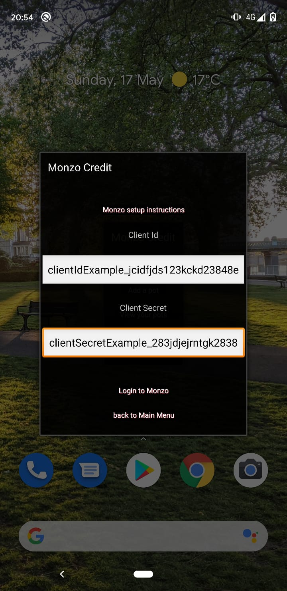
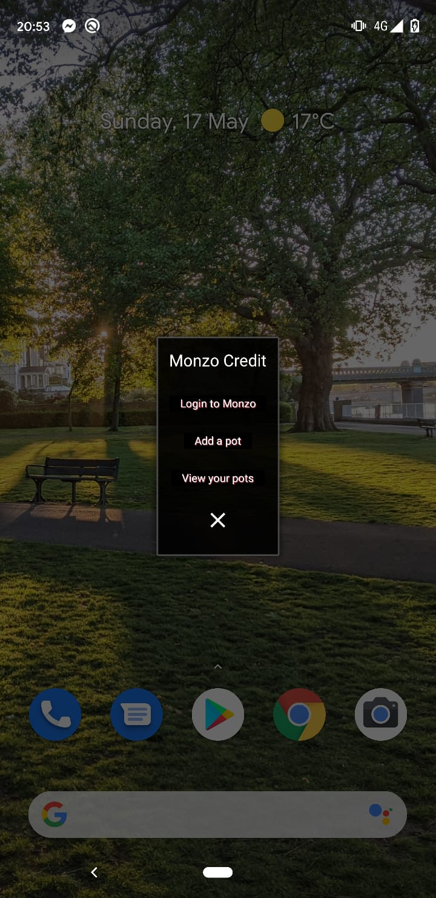
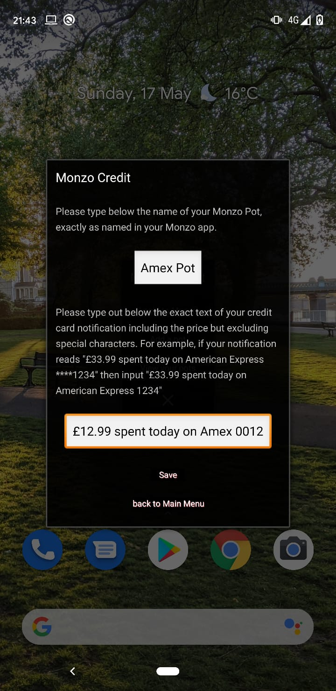
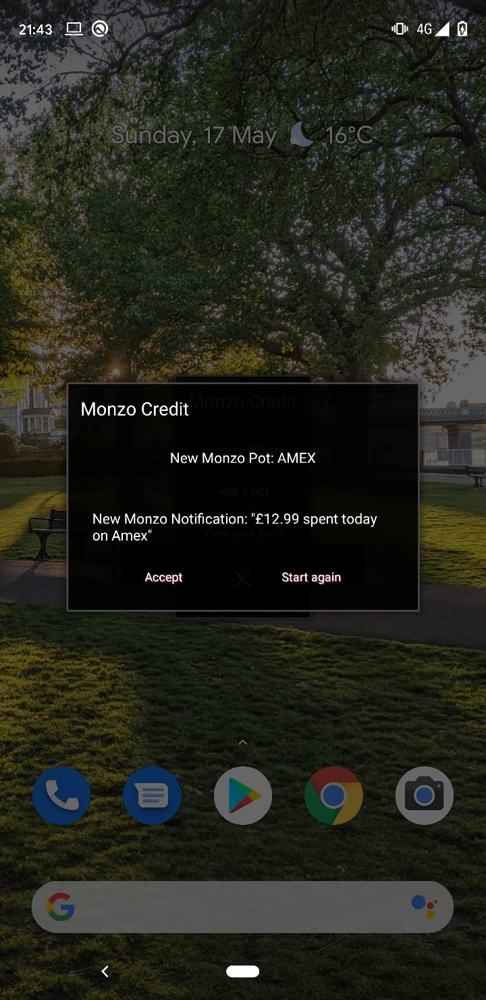
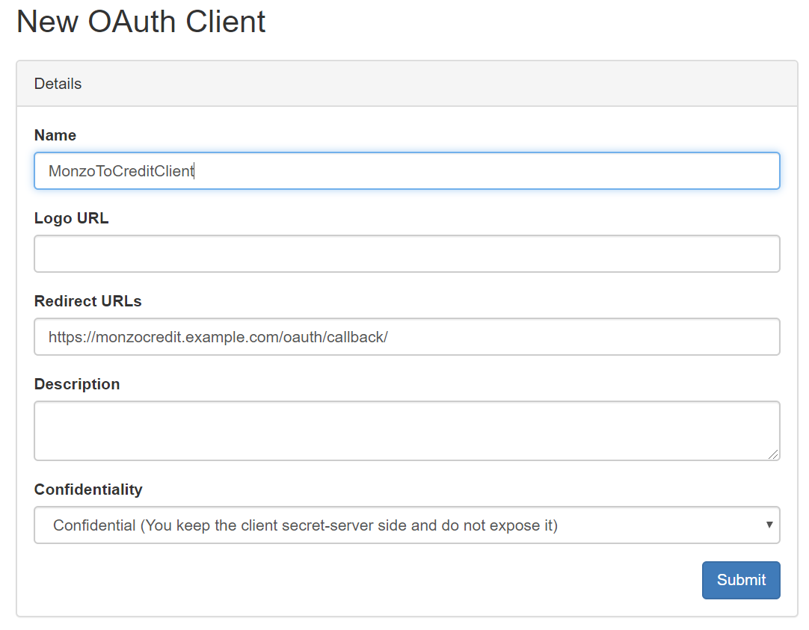

# MonzoCredit

App that integrates with the open Monzo API and reads your Google Pay notifications so that credit card expenditures 
can be transferred immediately to a separate Monzo pot. 

To setup you need to create a Monzo Auth client by going to https://developers.monzo.com/ and then input the client id and client secret into the app when you select **Login to Monzo**. When you setup your Auth client you need to add in the redirect url as https://tescotomonzo.example.com/oauth/callback/ and don't forget to set it to confidential (as shown in the Auth Client image below). You then need to add your Monzo pot and the notifcation you want to map the payment from. This app reads all your notifications and picks up specifically what you tell it to, so be careful. The Monzo API does not let you transfer money out of your account so there'll be a limit to the carnage you can cause. 

